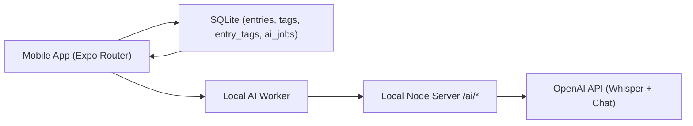

# Voice Journal - Product Note

## 1) Product intent

**Primary purpose**  
Capture short voice thoughts when typing is inconvenient, then convert them into a searchable and structured personal log.

**One-line statement**  
A mobile-first talk-to-journal app that turns voice into an organized, searchable, weekly-digestible memory stream.

## 2) Current implementation snapshot

- Platform: Expo React Native (TypeScript) with `expo-router`
- Data: local SQLite (`expo-sqlite`) with schema migrations
- Recording/playback: `expo-av`
- File persistence: `expo-file-system`
- AI processing: local queue + local backend proxy to OpenAI APIs
- Navigation: tabs (`Home`, `Record`, `Search`, `Insights`, `Settings`) + `Entry Detail`
- Date of note: 2026-02-08

## 3) End-to-end user flow

1. User records audio in `Record`.
2. Recording is saved to app document storage (`/audio/entry_<timestamp>.m4a`).
3. A DB entry is created immediately with `audio_uri` and `duration_sec`.
4. A transcribe job is enqueued (`ai_jobs`) and worker runs.
5. Worker calls backend transcription and stores `entries.transcript`.
6. Worker enqueues summarize job and stores `entries.summary`.
7. Worker requests AI tags and attaches to `entry_tags`.
8. Home/Search/Insights render updated content.
9. User can open `Entry Detail`, play audio, view transcript/summary, add/remove tags, retry AI tag generation.

## 4) Architecture



### App runtime

- `app/_layout.tsx` mounts root stack and calls runtime hook.
- `src/runtime/useAppRuntime.ts` does:
1. `initDb()` on app load.
2. `runAiWorker()` after init.
3. re-runs worker when app comes to foreground.

### Core modules

- DB client/migrations: `src/db/client.ts`, `src/db/schema.ts`
- Data access layer: `src/db/entries.ts`, `src/db/jobs.ts`
- Audio: `src/audio/recorder.ts`, `src/audio/player.ts`
- AI client/worker/themes: `src/ai/client.ts`, `src/ai/worker.ts`, `src/ai/themes.ts`
- Local AI server: `server/ai-local-server.cjs`

## 5) Data model

### `entries`

- `id TEXT PRIMARY KEY`
- `created_at INTEGER NOT NULL`
- `audio_uri TEXT NOT NULL`
- `duration_sec INTEGER NOT NULL`
- `transcript TEXT`
- `summary TEXT`
- `mood TEXT`
- `ai_status TEXT NOT NULL DEFAULT 'none'`
- `error_msg TEXT`

### `tags`

- `id TEXT PRIMARY KEY`
- `name TEXT NOT NULL UNIQUE`

### `entry_tags`

- `(entry_id, tag_id) PRIMARY KEY`
- cascades on delete from `entries` and `tags`

### `ai_jobs`

- `id TEXT PRIMARY KEY`
- `entry_id TEXT NOT NULL`
- `type TEXT` (`transcribe` | `summarize`)
- `status TEXT` (`queued` | `running` | `done` | `error`)
- `attempts INTEGER`
- `last_error TEXT`
- `created_at INTEGER`
- `updated_at INTEGER`

## 6) Screen implementation

### Home (`app/(tabs)/home.tsx`)

- Lists entries sorted by newest first.
- Shows title from first summary line or `Audio entry`.
- Shows date, duration, AI status, and tags.
- Tap navigates to `app/entry/[id].tsx`.

### Record (`app/(tabs)/record.tsx`)

- Mic permission handling with denied state.
- Controls: Start, Pause, Resume, Stop.
- Timer updates every ~300ms.
- Handles app background interruption and offers save.
- On stop:
1. stop/unload recording
2. persist file
3. create DB entry
4. enqueue AI transcribe job
5. navigate to Entry Detail

### Entry Detail (`app/entry/[id].tsx`)

- Loads one entry by id.
- Audio player: Play/Pause, Restart, +/-10s, slider, time display.
- AI card: shows status/error, `Process with AI` action.
- Tags:
1. manual add/remove
2. attach existing tags
3. `Generate tags with AI` retry button
- Displays transcript and summary.

### Search (`app/(tabs)/search.tsx`)

- LIKE search over transcript + summary.
- Displays matching entries and navigates to detail.

### Insights (`app/(tabs)/insights.tsx`)

- Entries per week
- Top tags
- Weekly themes (keyword extraction from summaries/transcripts) with entry ID references

### Settings (`app/(tabs)/settings.tsx`)

- AI backend status and health check button
- JSON export via share sheet
- CRUD diagnostic
- manual AI worker run and logs

## 7) AI integration design

### Why local backend

- OpenAI API key is never bundled directly in the mobile app.
- App calls local backend URL from `EXPO_PUBLIC_AI_API_BASE_URL`.
- Optional bearer token (`APP_AI_TOKEN`) protects local endpoints.

### Backend endpoints (`server/ai-local-server.cjs`)

- `GET /ai/health`
- `POST /ai/transcribe` (Whisper)
- `POST /ai/summarize` (title + bullets)
- `POST /ai/tags` (3-8 normalized tags)

### Queue behavior

- Prevents duplicate queued/running jobs per entry/type.
- Retries failed jobs up to max attempts.
- Writes errors to `entries.error_msg`.
- Keeps app responsive by processing async.

## 8) Environment configuration

Create `.env` at project root:

```env
OPENAI_API_KEY=sk-...
APP_AI_TOKEN=<random_token>
AI_LOCAL_PORT=8787
EXPO_PUBLIC_AI_API_BASE_URL=http://<your-lan-ip>:8787/ai
EXPO_PUBLIC_AI_API_TOKEN=<same_random_token>
```

Run locally (two terminals):

```bash
# Terminal 1
npm run ai:server

# Terminal 2
npm start -c
```

Phone and laptop must be on the same Wi-Fi.  
Use `Settings -> Test AI connection` in-app.

## 9) Prompt checklist status

### Prompt 1 - Scaffold

- Status: **Done**
- Notes: Expo Router TypeScript app + tabs + SQLite wiring present. Zustand package exists; current runtime is mostly DAL-driven.

### Prompt 2 - SQLite schema + DAL

- Status: **Done**
- Notes: migrations + CRUD implemented; diagnostics in Settings.

### Prompt 3 - Audio recording + playback

- Status: **Done**
- Notes: start/pause/resume/stop + timer + persistence + detail playback.

### Prompt 4 - Timeline + Entry Detail UI

- Status: **Mostly done**
- Notes: Home timeline + detail audio/tags/transcript/summary are present. Transcript editor + mood selector are not yet implemented as editable controls.

### Prompt 5 - Tagging

- Status: **Done**
- Notes: create/list/attach/detach + chips + AI-assisted generation and retry.

### Prompt 6 - AI queue

- Status: **Done**
- Notes: `ai_jobs`, foreground worker, queue button, status/error persistence.

### Prompt 7 - Transcription integration

- Status: **Done**
- Notes: local backend to OpenAI Whisper, status updates, retry behavior via queue attempts.

### Prompt 8 - Summaries + weekly themes

- Status: **Done for MVP**
- Notes: summary generation implemented; weekly themes generated via local heuristic from summary/transcript text.

### Prompt 9 - Search + export

- Status: **Done**
- Notes: LIKE search over transcript+summary; JSON export via share sheet.

### Prompt 10 - Hardening

- Status: **Mostly done**
- Notes: loading/error/empty states, permission denial, duplicate queue prevention, startup worker. No automated test suite yet.

## 10) Known gaps / next improvements

1. Add transcript editor and mood picker in Entry Detail (schema supports both).
2. Add automated tests for DB migrations, DAL, and worker flows.
3. Add richer tag-aware search (currently transcript+summary only).
4. Replace local-only backend with deployable secure API option for production.
5. Add observability (job metrics, latency, failure rate).
6. Remove or reconcile legacy `lib/*` prototype paths to reduce confusion.

## 11) Security notes

1. Never commit `.env` with real `OPENAI_API_KEY`.
2. Rotate keys immediately if exposed.
3. For production, use short-lived auth and a hosted backend, not direct public endpoints.

